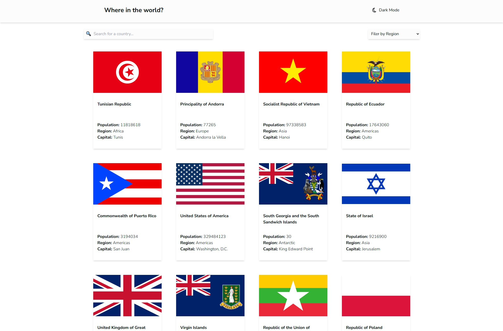

# Frontend Mentor - REST Countries API with color theme switcher solution

This is a solution to the [REST Countries API with color theme switcher challenge on Frontend Mentor](https://www.frontendmentor.io/challenges/rest-countries-api-with-color-theme-switcher-5cacc469fec04111f7b848ca). Frontend Mentor challenges help you improve your coding skills by building realistic projects. 

### The challenge

Users should be able to:

- See all countries from the API on the homepage
- Search for a country using an `input` field
- Filter countries by region
- Click on a country to see more detailed information on a separate page
- Click through to the border countries on the detail page
- Toggle the color scheme between light and dark mode *(optional)*

### Screenshot

### Links

- Solution URL: [https://github.com/Gwynbleidd222/Countries-Api]
- Live Site URL: [https://countries-api-three-eta.vercel.app/]

### Built with

- [React](https://reactjs.org/) – JS library
- [TypeScript](https://www.typescriptlang.org/) – for static typing
- [Tailwind CSS](https://tailwindcss.com/) – for styles
- [React Router](https://reactrouter.com/) – for routing
- [REST Countries API](https://restcountries.com/) – for fetching country data

### What I learned

This was my first project built with TypeScript, and it helped me understand how to use it in a real-world React application

